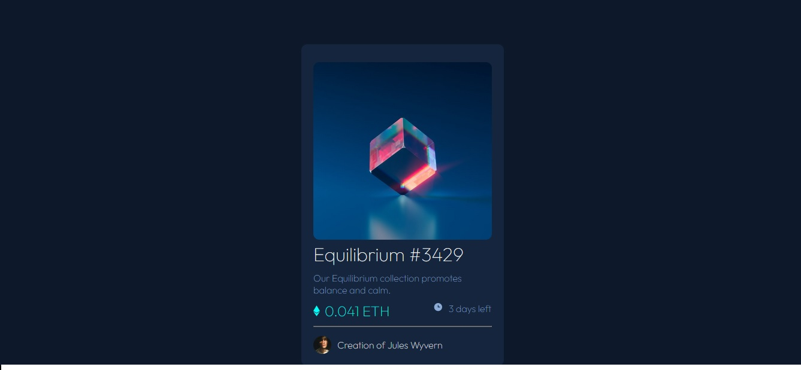

# Frontend Mentor - NFT preview card component solution

This is a solution to the [NFT preview card component challenge on Frontend Mentor](https://www.frontendmentor.io/challenges/nft-preview-card-component-SbdUL_w0U). Frontend Mentor challenges help you improve your coding skills by building realistic projects. 

## Table of contents

- [Overview](#overview)
  - [The challenge](#the-challenge)
  - [Screenshot](#screenshot)
  - [Links](#links)
- [My process](#my-process)
  - [Built with](#built-with)
  - [What I learned](#what-i-learned)
  - [Continued development](#continued-development)
  - [Useful resources](#useful-resources)
- [Author](#author)

## Overview

### The challenge

Users should be able to:

- View the optimal layout depending on their device's screen size
- See hover states for interactive elements

### Screenshot




### Links

- Live Site URL: [Github Pages](https://ladylucyfurr.github.io/nft-preview-card-component-main/index.html)

## My process

### Built with
- HTML5
- Flexbox

### What I learned

This is the first time I've used media queries to optimize the site for different screen sizes. Here's the code I used for medium-sized screens:

```css
@media screen and (max-width: 768px) {
    .card {
        width: 90%;
    }

    h2.block {
        font-size: 20px;
    }

    p.pad {
        font-size: 18px;
    }

    #name {
        font-size: 18px;
    }
}
```

### Continued development

I would like to learn how to show another image on top of an image on hover. I couldn't figure out how to cover the image completely with the cyan color.
I'd also like to learn how to get the ring around the avatar picture. Is it a circle around the image or an image on top of a white circle?
Still need to learn how to adjust font weight with Google Fonts.

### Useful resources

- [Flexbox Froggy](https://flexboxfroggy.com/) - This was a cute fun game that helped me to visualize how the flexbox properties work to move the items around and let me practice what I'd learned.

## Author

- Frontend Mentor - [@LadyLucyfurr](https://www.frontendmentor.io/profile/LadyLucyfurr)
